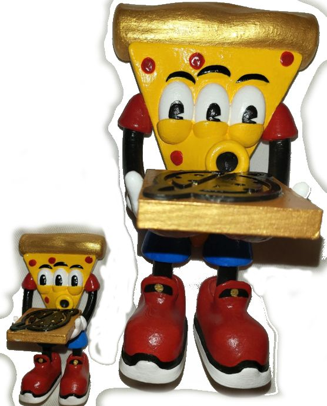

Molto Benny 2024
================

Behold how Molto Benny, beloved mascot of PizzaDAO[^PizzaDAO], journeys into material existence.

Part of Ryan Makes theme of making thoughts into things, manifesting dreams into realities.

### Accepting all bids during Benny's first public showing, Art Of Fashion June 15 2024 at Toronto's Goat Gallery.
Each hand painted 3D printed Benny comes with a rare Benny NFT[^bennynft]

Bids are meme numbers, for the culture.

#### Bidding starts at **0.1337 ETH** for Little Brother Benny
#### Bidding starts at **0.69420 ETH** for Big Brother Benny

"Buy it all now" price **3.14 ETH** includes both Benny Boy Brothers, two rare Benny NFTs, AND a Rare Pizzas NFT Pizza Box[^pizzabox], making you a member of the PizzaDAO famiglia!

Credits:
--------
Original concept design and illustration by Brandon Forant
@infi1trate[^infi1trate]

3D model design by brauxelion
@brauxelion_[^brauxelion]

3D printing by Ryan Makes @ryanmakes.ca[^ryanmakes]

Hand painting Anastasia @from.Anastasia.with.Love[^anastasia]

Background and Lore:
--------------------

Molto Benny was born as a two eyed pizza slice in a Rare Pizzas Box. He thought to himself, "what if pizza were free?"... and his third eye popped out!

Molto Benny is the mascot of PizzaDAO. ( a DAO is like a group chat with a bank account, but it can get fancy )

PizzaDAO is all about free pizza parties.
We hand out pizza to everyone, all over the world!
This year on Bitcoin Pizza Day, we feasted and partied in Toronto and over 200 other cities!

Part of every sale of any Benny will be used to fund pizza to be given away for free, because that's what Benny would want.
Ryan Makes will also be using part of every sale to buy laptops and other educational equipment for a learning center for kids with disabilities where he volunteers.

Ryan Makes has been a proud member of the PizzaDAO family for years, helping coordinate the DAO and parties like Toronto's Pizza Day.
When asked questions like "isn't everything 'crypto' bad?" Ryan's locked-and-loaded answer is "The world is full of scams, but the pizza is real. PizzaDAO has never lied to me - promises made are promises kept. That's rare! Have a slice!"

Ryan wanted the Benny toy depicted in the NFT to be real, so he forced it into existence and now you can hold it in your hand.

## Bottom Line
### This is a rare chance to support great causes and get to own a unique part of history.
### Be a hero at every Pizza Day forever with your own OG Benny sculpture!

Links:

[^PizzaDAO]:( [PizzaDAO](http://pizzadao.xyz) )
[^bennynft]: ( [Benny NFT](https://zapper.xyz/nft/ethereum/0xbc276e47ccc9cd641cf58932a006fdad5f51a9a9/3) )
[^pizzabox]: ( [Rare Pizzas PizzaDAO Pizza Box](https://www.rarepizzas.com/) )
[^infi1trate]: ( [instagram @infi1trate](https://www.instagram.com/infi1trate/) )
[^brauxelion]: ( [twitter @brauxelion_](https://x.com/brauxelion_))
[^ryanmakes]: ( You are on RyanMakes.ca right now, this is my website ^_^ [instagram @ryanmakes.ca](https://www.instagram.com/ryanmakes.ca) )
[^anastasia]: ( [instagram @from.Anastasia.with.Love]((https://www.instagram.com/from.anastasia.with.love/)) )
[^artoffasion]: ( [Art Of Fashion June 15 2024](http://artoffashion.ca/) )
[^goatgallery]: ( [Goat Gallery](https://www.goat.gallery/) )
[^qrcode]: ( [QR code for https://ryanmakes.ca/benny/ (this page)](qr-code-ryanmakesca-benny.png) )
