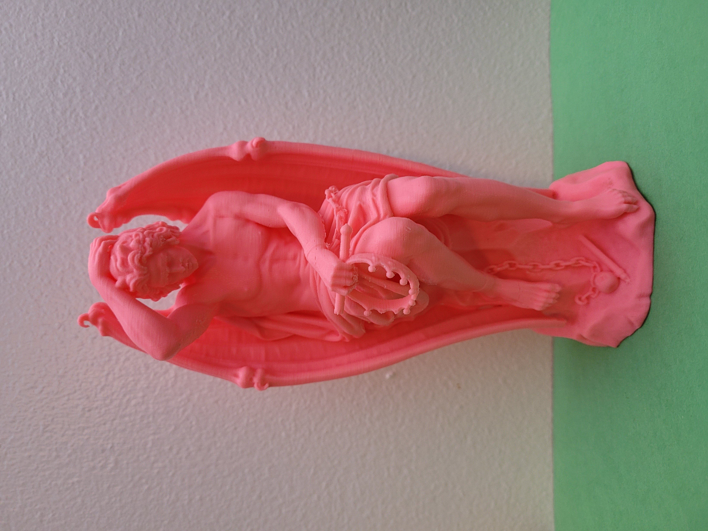

# Lucifer

Ryan Makes Lucifer for Mallo stands on the shoulders of giants.
This Lucifer is a 3d print of a digitally sculpted master study of a 1848 marble sculpture named [Le Genie Du Mal](https://en.wikipedia.org/wiki/Le_g%C3%A9nie_du_mal).

Based on [Le Genie Du Mal](https://en.wikipedia.org/wiki/Le_g%C3%A9nie_du_mal), originally comissioned by the church in .... based on the character from historically best-selling book series The Bible.

This narrative and physical form have inspired many generations of artists.

